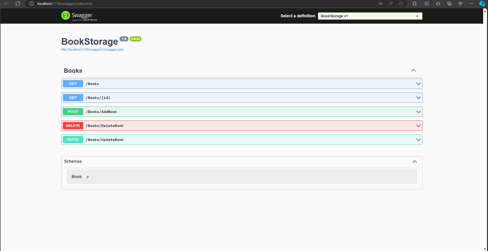

# **Book Storage API**

## Introduction

This project is an API for storing books. It provides endpoints for searching books, searching by ID, changing and adding new books.



## Usage

### Endpoints

- **GET /api/v1/Books**: Get all books.
- **GET /api/v1/Books/1**: Get book by id.
- **POST /api/v1/Books/AddBook**: Add a new book.
- **DELETE /api/v1/DeleteBook?id=1**: Delete by id.
- **PATCH /api/v1//UpdateBook?id=1**: Update by id.

### Request Examples

#### Get all books

```http
GET /api/v1/books
```

#### Get book by id

```http
GET /api/v1/Books/1
```

#### Add a book

```http
POST /api/v1/AddBook
Content-Type: application/json

{
  "id": 1,
  "name": "Book name",
  "author": "Book Author",
  "description": "Book Description",
  "page": 0,
  "price": 0
}
```

#### Delete book by id

```http
DELETE /api/v1/DeleteBook?id=1
```

#### Update book by id

```http
PATCH /api/v1/UpdateBook?id=1
Content-Type: application/json

{
  "id": 1,
  "name": "Book name new",
  "author": "Book Author new",
  "description": "Book Description new",
  "page": 0,
  "price": 0
}
```

## Technologies Used

- C#
- .NET Core
- PostgreSQL
- Entity Framework
- Fluent Validation